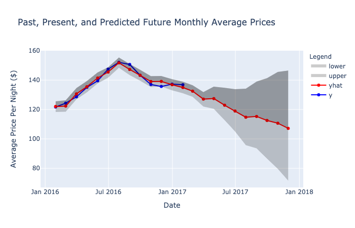

# Machine Learning with Python

## Tepper MBA PTOH CY21 AW4 Workshop

### Quick Start

#### Want to play with these notebooks online without having to install anything? Use [Google's Colaboratory](https://colab.research.google.com/github/carriegardner428/ML-with-Python-Tepper-CY21-AW4/blob/main/)!

#### Want to install this project on your own machine?

##### Docker Install
1. Build Docker Image
   - `docker build . -t ml`
2. Run Docker Container
   - `docker run -p 8888:8888 -v $(pwd):/home/jovyan/work ml`
3. Open Jupyter notebook!

##### Host Install
1. Install Anaconda
2. Clone this project
3. Install Dependencies
4. Add Kernel, `python -m ipykernel install --user --name=ml`
5. Run Jupyter, `jupyter notebook`

